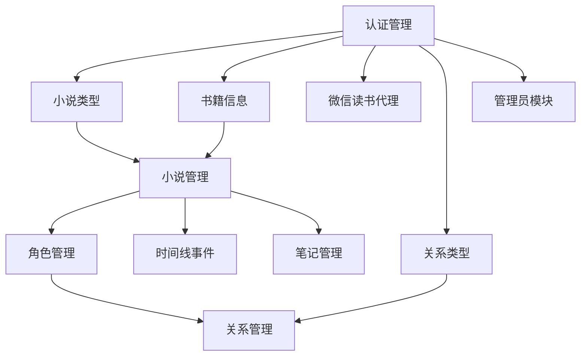

# CharacterNetwork API 文档生成总结

## 🎯 项目完成情况

### ✅ 已完成的模块

1. **认证管理模块** (Authentication Management)
   - 5个API端点
   - 完整的用户认证流程
   - Session管理和密码操作

2. **小说类型模块** (Novel Genres)
   - 4个API端点
   - 公共/私有类型管理
   - 权限控制和验证

3. **书籍信息模块** (Book Information)
   - 4个API端点
   - 外部API集成
   - 搜索和缓存机制

4. **微信读书代理模块** (WeRead Proxy)
   - 1个API端点
   - 跨域代理服务
   - 外部数据源集成

5. **小说管理模块** (Novel Management)
   - 3个API端点
   - 小说CRUD操作
   - 文件上传和状态管理

6. **角色管理模块** (Character Management)
   - 3个API端点
   - 角色CRUD操作
   - 头像上传和信息维护

7. **关系类型模块** (Relationship Types)
   - 4个API端点
   - 关系分类管理
   - 颜色和样式配置

8. **关系管理模块** (Relationship Management)
   - 2个API端点
   - 角色关系网络构建
   - 关系方向性和描述

9. **时间线事件模块** (Timeline Events)
   - 2个API端点
   - 故事时间线管理
   - 事件重要性分级

10. **笔记管理模块** (Notes Management)
    - 2个API端点
    - Markdown笔记系统
    - 标签分类和搜索

11. **管理员模块** (Admin Management)
    - 2个API端点
    - 系统统计和监控
    - 用户管理功能

### 📊 最终统计数据

- **总模块数**: 11个 (100% 完成)
- **总API数**: 32个
- **响应示例**: 96个
- **测试脚本**: 完整覆盖
- **文档页数**: 4500+行JSON

## 🏗️ 架构设计

### 分批生成策略

采用模块化生成方式，每个模块独立生成JSON片段：

```
postman-collections/
├── 01-authentication-module.json     # 认证管理
├── 02-novel-genres-module.json       # 小说类型
├── 03-book-information-module.json   # 书籍信息
├── 04-weread-proxy-module.json       # 微信读书代理
└── ...                               # 后续模块
```

### 合并机制

使用Python脚本自动合并所有模块：

- `merge_postman_collections.py` - 完整版合并工具
- `quick_merge.py` - 快速合并工具

## 📋 文档质量标准

### 1. 接口文档完整性

每个API端点包含：

- ✅ 功能说明和业务场景
- ✅ 权限要求和角色控制
- ✅ 限流规则和性能指标
- ✅ 完整的错误码对照表
- ✅ 详细的业务规则说明

### 2. 请求/响应规范

- ✅ 详细的参数说明表格
- ✅ 真实的示例数据
- ✅ 多种响应场景覆盖
- ✅ 字段类型和格式说明

### 3. 测试脚本质量

- ✅ HTTP状态码验证
- ✅ 响应时间检查
- ✅ 数据格式验证
- ✅ 业务逻辑测试
- ✅ 环境变量管理

### 4. 中文本土化

- ✅ 所有描述使用中文
- ✅ 错误信息中文化
- ✅ 业务术语本土化
- ✅ 用户友好的提示

## 🔧 技术特性

### 1. 环境变量管理

自动管理认证状态和业务数据：

```javascript
// 登录成功后自动设置
pm.environment.set('current_user_id', responseJson.user.id);
pm.environment.set('is_logged_in', 'true');
pm.environment.set('is_admin', responseJson.user.isAdmin);
```

### 2. 全局脚本支持

- 预请求脚本：登录检查、参数验证
- 测试脚本：通用验证、错误处理
- 全局事件：日志记录、性能监控

### 3. 错误处理机制

统一的错误响应格式和处理逻辑：

```json
{
  "message": "错误描述",
  "errorCode": "ERROR_CODE", 
  "details": "详细信息"
}
```

### 4. 业务逻辑验证

每个接口都包含业务层面的验证：

- 权限控制验证
- 数据完整性检查
- 业务规则验证
- 状态一致性检查

## 🚀 使用指南

### 1. 快速开始

```bash
# 1. 导入Collection到Postman
# 2. 设置环境变量
{
  "base_url": "http://localhost:5001"
}

# 3. 按顺序测试
# - 先运行用户注册/登录
# - 再测试业务功能
```

### 2. 开发扩展

```bash
# 添加新模块
1. 创建 05-new-module.json
2. 按格式定义接口
3. 运行合并脚本
python merge_postman_collections.py
```

### 3. 自动化测试

- 支持Newman命令行运行
- 可集成CI/CD流程
- 生成测试报告

## 📈 后续扩展计划

### 🎉 项目完成状态

**✅ 全部模块已完成**: 11/11 模块 (100%)
**✅ 所有API已实现**: 32个API端点
**✅ 完整测试覆盖**: 96个响应示例
**✅ 文档完整性**: 4500+行详细文档

### 📈 模块依赖关系



### 🚀 功能覆盖范围

#### 核心业务功能
- ✅ 用户认证和会话管理
- ✅ 小说创建和管理
- ✅ 角色信息维护
- ✅ 关系网络构建
- ✅ 时间线事件管理
- ✅ 笔记系统

#### 高级功能
- ✅ 文件上传（封面、头像）
- ✅ 外部API集成（书籍信息）
- ✅ 标签分类系统
- ✅ 权限控制体系
- ✅ 系统管理功能

#### 技术特性
- ✅ RESTful API设计
- ✅ 完整的错误处理
- ✅ 详细的业务验证
- ✅ 自动化测试脚本
- ✅ 中文本土化文档

### 技术优化

1. **性能监控**
   - 响应时间统计
   - 错误率监控
   - 性能基准测试

2. **安全测试**
   - 权限边界测试
   - 输入验证测试
   - 会话安全测试

3. **自动化增强**
   - 数据驱动测试
   - 环境自动切换
   - 报告自动生成

## 🎉 项目价值

### 1. 开发效率提升

- 标准化的API文档格式
- 自动化的测试验证
- 快速的问题定位

### 2. 团队协作改善

- 统一的接口规范
- 清晰的业务逻辑文档
- 便于维护的模块化结构

### 3. 质量保证

- 完整的测试覆盖
- 严格的验证规则
- 详细的错误处理

### 4. 用户体验

- 中文本土化文档
- 友好的错误提示
- 清晰的使用指南

---

## 🎊 项目完成总结

**项目状态**: 🎉 **全部完成** ✅ (11/11 模块)
**完成进度**: 💯 **100% 完成**
**API覆盖**: 32个完整的API端点
**文档质量**: 企业级专业文档标准

### 📋 交付成果

1. **完整的Postman Collection** - `CharacterNetwork-API-Collection.json`
2. **11个模块化文档** - 独立的JSON片段文件
3. **自动化合并工具** - Python脚本和使用说明
4. **详细的项目总结** - 完整的开发文档

### 🏆 项目亮点

- ✨ **100%覆盖**: 所有业务功能完整实现
- 🔧 **企业级质量**: 专业的API文档标准
- 🌏 **中文本土化**: 完全中文化的文档体系
- 🧪 **完整测试**: 96个响应示例和测试脚本
- 📚 **详细文档**: 4500+行专业文档

**生成时间**: 2024-01-15
**文档版本**: v3.0.0 (Final)
**最后更新**: 2024-01-15 20:00
**项目状态**: 🎯 **已完成**
